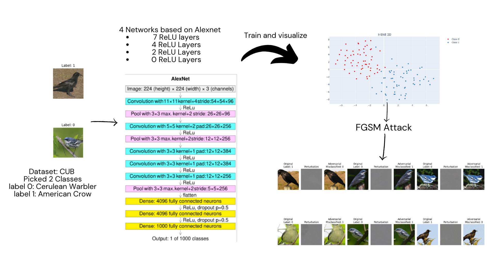

## Dawit Getahun, Abenezer Kebede, Mahlet Dereje, , Ayda Sultan

# Table of Contents
1. [INTRODUCTION](#introduction)
2. [BACKGROUND](#background)
3. [EXPLAINING ADVERSARIAL IMAGES](#explaining-adversarial-images)
4. [FRAMEWORK](#framework)
5. [RESULTS](#results)
6. [CONCLUSION](#conclusion)
7. [REFERENCES](#references)

# INTRODUCTION

Current systems that utilize state-of-the art deep learning techniques have shown remarkable performance in vision and text tasks. We communicate with these systems and have made them part of our daily routines. Without a significant overlap in the semantics of our exchange, the communication would have been impossible. But when asking deeper questions (no pun intended) in how we humans and machines can extract the same meaning from an input or a query, we find that sometimes the same semantic information might not be extracted.

)")

*Fig 1: Adversarial Example (Goodfellow(2014))*

In figure1, the model initially classified the input image as a panda with a 57.7% confidence. But after the image was manipulated by adding a very small perturbation that is imperceptible to the human eye, the resulting image was misclassified as a gibbon by the model with a very high 99.3% confidence. And researchers found that this phenomenon was not an isolated random occurrence but rather an inherent flaw of neural networks and how they learn features. In fact, the same perturbations can cause models with various architectures to misclassify input images even when the dataset is entirely different.

# BACKGROUND

Szegedy (2013) and his group were the first to coin the term ‘adversarial examples’ for the perturbed images that were misclassified. Their paper highlighted this problem and demonstrated a neural network can be caused to misclassify an image by applying a hardly perceptible perturbation which can be found algorithmically by maximizing the network’s prediction error. The researchers named the process of finding training set examples that are assigned low probabilities by the model but should be of high probabilities, hard negative mining. Their explanation of this phenomena was focused on highlighting blind spots that exist in low probability areas of the manifold of the decision boundaries in higher dimension spaces. 

When considering an input-output mapping of training examples and their labels in the input’s representation space, (in pixel space for images),  we might find the distance between input a and b with the same label can sometimes be very large. But the understanding is both inputs encode similar features and statistical structures that describe the same class. For images, it might be the case that the two images show the same object but from different viewpoint perspectives.  The magic of deep learning is, it enables us to assign probabilities to regions of the input space and by this process assigning lower scores to  areas with less training examples. This leads to the implicit assumption that for a very small radius r and a given training input x, an x+r is assigned to the correct class given ||r|| is less than the distance between x and the next closest decision boundary. And this important assumption, called the smoothness assumption, should hold true especially if the radius added to the input produces an example with imperceptible differences from the input. It was the failure of this assumption for deep networks that was highlighted for the first time in 2013.  
The most intriguing part of this discovery was that these perturbations can be calculated by traversing the manifold representation of the network in an optimized manner, and finding adversarial examples in the input space. Szegedy (2013) explains these examples as low-probability (high-dimensional) “pockets” in the manifold. 

As you can expect, this has very high implications in safety and regulations for AI systems that operate in the real-world. (Kumar et al, 2021) were able to conduct a black box attack of autonomous vehicles and make the system understand the ‘stop’ sign as a ‘yield’ sign. 

*Fig 2: black box attack of autonomous vehicles (Kumar et al, 2021)*

So what is the cause of this phenomenon? And even more importantly, how can we design robust models that can resist these perturbations? 

# EXPLAINING ADVERSARIAL IMAGES

The explanation offered by Szegedy (2013) was to imagine adversarial examples as pockets in the input space with extremely low probability of being observed and identified correctly. To explain this observation, the authors used the analogy of real numbers and rational numbers in the number system. There is a rational number in the vicinity of every real number but the probability of observing the rational number in any neighborhood (interval) is extremely low and virtually close to zero. This analogy equates natural samples to real numbers and adversarial samples to rational numbers, highlighting their rarity and proximity within the input space. This explanation suggests the models are learning input-output mappings with excessive non-linearity. 

On the contrary, the explanation offered by Goodfellow (2014) describes the phenomenon as a problem arising from excessive linearity of deep-linear techniques. The work showed the existence of adversarial examples for most machine learning techniques including linear models. Their work specified that even simple linear models can have adversarial examples if there is enough dimensionality in the input spaces. They also introduced the Fast Gradient Sign method which they claimed as capable of producing adversarial examples quicker and with higher volume than any prior methods. The method exploits the opposite direction of the gradient descent to find the perturbations. 

After stipulating that adversarial examples can be computed for all kinds of models, the researchers explained the existence of such examples as side effects of linear classifiers in high dimensions.  

*Fig 3: excessive linearity being shown in high dimensions of the decision boundaries (img from: https://www.iangoodfellow.com/slides/2016_10_5_CS294-131.pdf)*

The excessive-linearity explanation stipulates that current deep learning algorithms are showing this behavior because they are trained with algorithms that prefer linear models. Figure 2 shows how linear decision boundaries in high-dimensional spaces, according to this explanation, can lead to adversarial examples. In this scenario, examples with small perturbations to the inputs (represented by red) can cause the model to misclassify them. This is because the decision boundary is very sensitive to small changes in the input space, especially in high dimensions where the space becomes increasingly complex. A key component of their claim was for linear models, robustness against adversarial examples weakens with increased dimensionality. 

Fawzi et al. (2015): The authors discuss a framework that studies the instability of classifiers to adversarial perturbations. This framework establishes fundamental limits on the robustness of classifiers based on a distinguishability measure between classes in a dataset. For linear classifiers, distinguishability is defined as the distance between the means of two classes. For non-linear classifiers, it is based on the distance between the matrices of second-order moments. The analysis suggests that adversarial examples exist not only for deep neural networks but also for other types of classifiers. The vulnerability is traced back to the low flexibility of classifiers, which contrasts with the earlier belief that high non-linearity in neural networks is the primary cause of adversarial susceptibility.

Tabacof and Valle (2016): The authors explore the pixel space of adversarial examples by generating adversarial images for both shallow and deep networks on datasets like MNIST and ImageNet. They empirically demonstrate that adversarial examples appear in large regions of the pixel space, supporting the idea that adversarial perturbations are not isolated anomalies. They argue that even weak, shallow, and more linear classifiers are as susceptible to adversarial examples as deep, non-linear classifiers, which challenges the linearity hypothesis proposed by Goodfellow et al. (2015).

Tramer et al. (2017): This work estimates the dimensionality of the space of adversarial examples. The authors claim that adversarial examples span a high-dimensional space (e.g., dimensionality ≈ 25), which allows the subspaces of different classifiers to intersect. This intersection is responsible for the transferability of adversarial examples across models.
The authors suggest that it is possible to defend against transfer-based attacks even if a model remains vulnerable to direct attacks.

Tanay and Griffin (2016): This work provides a boundary tilting perspective on the existence of adversarial examples. The authors argue that adversarial examples arise when the decision boundary of a classifier lies close to the sub-manifold of the data distribution for a given class.They formalize the notion of adversarial strength, which is related to the deviation angle between the decision boundary of the classifier and the nearest centroid classifier. They also suggest that regularization during training can improve the adversarial stability of classifiers. The authors critique the linearity hypothesis, calling it "unconvincing" and argue that adversarial examples are more closely related to the geometry of decision boundaries.

Cubuk et al. (2017): This work argues that the origin of adversarial examples lies in the inherent uncertainty that neural networks have about their predictions. The authors empirically compute a functional form of this uncertainty, which is shown to be independent of the network architecture, training protocol, and dataset. They claim that this uncertainty leads to a universal scaling of fooling ratios with respect to the size of the perturbation. They also observe a correlation between the accuracy of a network on clean images and its adversarial robustness.

Rozsa et al. (2016): This work hypothesizes that adversarial perturbations exist due to evolutionary stalling of decision boundaries during training. The authors argue that once training samples are correctly classified, they stop contributing to the training loss, leaving them close to the decision boundary. This makes them susceptible to minor perturbations that can push them into the wrong class region. They propose the Batch Adjusted Network Gradients (BANG) algorithm to mitigate this stalling effect during training.

A key concept in adversarial machine learning is adversarial transferability, where perturbations computed for one model can transfer to another. The existence of universal perturbations that are input agnostic has been shown (Moosavi-Dezfooli et al 2017). So it is natural to assess this adversarial subspace that has plagued virtually any input space. “Adversarial Examples Are Not Bugs, They Are Features” (Ilyas et al., 2019) proposed a framework claiming most standard datasets contain features deep networks are learning that are not robust in the sense that they are brittle and incomprehensible to humans  but also highly predictive. These features are statistically useful but not robust to small perturbations. We can say for example the presence of pointed ears in cats is a robust feature. In contrast, non-robust features might include subtle patterns in pixel values that can be easily disrupted.

")

*Fig 4: robus and non-robust features (Ilyas et al., 2019)*

It was shown in their work that input data X can be decomposed into two components: Xrobust and Xnon-robust. The non-robust dataset resulted in good standard accuracy but poor performance in robustness. So the explanation that was provided by them was that non-robust features were responsible for adversarial examples. 

But this explanation was also challenged by the paper “Adversarial Examples Are Not Real Features” (Li, A., Wang et al., 2024). Their research showed that these non-robust features are not transferable to other non-supervised paradigms like contrastive learning and diffusion models. 

## ADVERSARIAL ATTACKS
In General, There are two types of attacks, White-box attacks and Black-box attacks. In the case of a white-box attack, The attacker has full knowledge of the model's architecture, parameters, and training data. Some of the attacks are Fast Gradient Sign Method (FGSM, discussed in detail below), Projected Gradient Descent (PGD), Jacobian-based Saliency Map Attack (JSMA), and Carlini & Wagner Attack. In a black-box attack, The attacker has limited or no knowledge of the model's internals. Attacks in this scenario rely on observing the model's output for different inputs. 

### FGSM

FGSM leverages the gradients of the model's loss function with respect to the input image.
Gradients indicate the direction of the steepest ascent or descent of the loss. Calculate the sign of each element in the gradient vector (positive, negative, or zero). Then multiply the sign of the gradient by a small constant (epsilon, ϵ) to create the perturbation. 

        The mathematical representation:

                x: original input image  
                J(θ, x, y): loss function  
                θ: model's parameters  
                y: true label of the image

                x' = x + ε * sign(∇xJ(θ, x, y)) 

*Fig 5: FGSM attack example*

# FRAMEWORK

In our study we wanted to empirically study the causes of adversarial behaviors in vision models. Szegedy et, al (2013) gave an extensive explanation on the relationship between activation functions and semantics. Often a single activation unit of a neuron is treated as a meaningful feature. While analyzing single neurons by finding images that maximized their activations results in a representation of a single feature, their results showed random combinations (in directions that do not maximize the feature along the basis vector) also produced similarly meaningful results. The implications are that the feature space learned by neural networks is not disentangled and semantic properties are not isolated to specific neurons but instead are distributed across the feature space. 

Based on the above explanation, as we increase the number of non-linear transformations the feature maps extracted from the network become more entangled. With this in mind, we can use the number of activation layers as a way to track the complexity of extracted features and non-linearity. Because this study was initially conducted using AlexNet, it also became the selected neural architecture for our experiments. 

To conduct our experiments, we chose the CUB-200-2011 (Caltech-UCSD Birds-200-2011) benchmark dataset. This dataset contains 11,788 images (5,994 for training and 5,794 for testing) of 200 subcategories belonging to birds, and is considered one of the most difficult datasets because of the highly similar semantic information and very subtle differences in appearance between species.

  
  

*Fig 6: Showing 2 selected classes from the CUB-200-2011 dataset. (a) (left) an American Crow,(b) (right) a Cerulean Warbler*

Because the AlexNet architecture is not a good performer on the original class size of 200, and we wanted to make isolated assessments of our adversarial attempts, we picked the two classes shown in the above figure. To gauge the effects of increased complexity in feature space or non-linearity, we prepared 4 versions of the AlexNet network with varying number of activation layers; variant A with 7 ReLU layers (same as the original architecture), variant B with 4 ReLU layers, variant C with 2 ReLU layers, and variant D with no activation layers but with the dropout and pooling layers reserved. To generate adversarial examples, we employed the FGSM method, which was originally proposed by Goodfellow et al (2014) to challenge the excessive non-linearity explanation of this phenomenon, using varying values of 0.01, 0.1, and 0.15 for the epsilon ε  constant. The overall framework is shown in the diagram below. 

*Fig 7: diagram showing our experiment framework (alexnet architecture image sourced from: https://en.wikipedia.org/wiki/File:Comparison_image_neural_networks.svg)*

# RESULTS

We trained all 4 variants of our AlexNet architecture on the same dataset of the 2 selected classes. In terms of accuracy on the test samples the architecture with the most non-linearity performed better. This aligns with the assumption that the increasing complexity of the deep neural networks allows them to perform better. 

*Fig 8: 2D visualization of the dataset selected with AlexNet using (left) PCA and (right) t-SNE*

| Architecture       | Accuracy |
|--------------------|----------|
| AlexNet (7ReLU)    | 94.44%   |
| AlexNet (4ReLU)    | 88.89%   |
| AlexNet (2ReLU)    | 83.33%   |
| AlexNet (0ReLU)    | 88.89%   |

*Table 1: Table showing model performances on the test set.*

We then applied the FGSM method to attack each of the resulting models with varying epsilons and were able to generate adversarial examples to virtually all inputs of the datasets for all of the models. What we discovered was that the models with increased non-linearity were not any less resistant to adversarial examples. Some of the examples can be shown on the examples below and we can see there is not a really perceptible difference between the inputs which are shown on the left and the adversarial examples on the right.

  
  

*Fig 9: sample of adversarial examples generated using FGSM on AlexNet(4ReLU) with epsilon values 0.1 and 0.15*

| Epsilon Values | AlexNet (7ReLU) | AlexNet (4ReLU) | AlexNet (2ReLU) | AlexNet (0ReLU) |
|----------------|-----------------|-----------------|-----------------|-----------------|
| 0.01           | 32.50%          | 50.00%          | 12.50%          | 00.00%          |
| 0.1*           | 0.00%           | 0.00%           | 0.00%           | 0.00%           |
| 0.15*          | 0.00%           | 00.00%          | 0.00%           | 0.00%           |

*We are able to generate adversarial examples that were misclassified 100% of the time.

*Table 2: Table showing performance against adversarial attack (FGSM).*

Decreasing the number of activation layers doesn’t make our models more robust against adversarial examples. We were able to see that increased non-linearity does improve accuracy but not model robustness against adversarial examples. At ε=0.1 and ε=0.15, adversarial examples fooled all models with 100% success, regardless of non-linearity. This is against the hypothesis that adversarial examples arise from excessive non-linearity creating “low-probability pockets” in the input space.

# CONCLUSION

The main takeaways from our work are described here below:

1. Linearity Theory Partially Supported:
The linear model (0ReLU) performed surprisingly well on clean data (88.89% accuracy) but collapsed entirely under even small perturbations (0% accuracy at ε=0.01). This aligns with Goodfellow's hypothesis that the adversarial example phenomenon originates from the linear nature of neural networks in high-dimensional spaces. This linear nature enables small perturbations in high-dimensional spaces to produce significant changes in output.
 

2. Adversarial Susceptibility is Architecture-Agnostic:
The near-identical performance drop across architectures (see Table 2) shows alignment with the explanation provided by Ilyas et al.’s (2019) in that adversarial vulnerability is a systemic property of neural networks and standard training paradigms rather than a result of linearity or non-linearity alone. This supports the claim that models exploit non-robust features, which are brittle under perturbations.

3. Limitations:
We mainly only experimented with AlexNet and did not explore other neural architectures. Incorporation of non-linear classifiers in higher dimensions in the final layers. (eg. RBF/gaussian) and maxout networks were part of Goodfellow’s discussion in regards to exploring robustness against adversarial attacks. We also only used 2 classes from the CUB dataset and this might admittingly be an oversimplification of the task.

# REFERENCES 

Szegedy, C., 2013. Intriguing properties of neural networks. arXiv preprint arXiv:1312.6199.

Goodfellow, I.J., Shlens, J. and Szegedy, C., 2014. Explaining and harnessing adversarial examples. arXiv preprint arXiv:1412.6572.

Kumar, K.N., Vishnu, C., Mitra, R. and Mohan, C.K., 2020, October. Black-box adversarial attacks in autonomous vehicle technology. In 2020 IEEE Applied Imagery Pattern Recognition Workshop (AIPR) (pp. 1-7). IEEE.

Moosavi-Dezfooli, S.M., Fawzi, A., Fawzi, O. and Frossard, P., 2017. Universal adversarial perturbations. In Proceedings of the IEEE conference on computer vision and pattern recognition (pp. 1765-1773).

Ilyas, A., Santurkar, S., Tsipras, D., Engstrom, L., Tran, B. and Madry, A., 2019. Adversarial examples are not bugs, they are features. Advances in neural information processing systems, 32.

Li, A., Wang, Y., Guo, Y. and Wang, Y., 2024. Adversarial examples are not real features. Advances in Neural Information Processing Systems, 36.

Wah, C., Branson, S., Welinder, P., Perona, P., & Belongie, S. (2011). The Caltech-UCSD Birds-200-2011 Dataset. California Institute of Technology, CNS-TR-2011-001.

Catherine Wah, Steve Branson, Peter Welinder, Pietro Perona, and Serge Belongie. The caltech-ucsd birds-200-2011 dataset. 2011 

Krizhevsky, Alex; Sutskever, Ilya; Hinton, Geoffrey E. (2017-05-24). "ImageNet classification with deep convolutional neural networks" (PDF). Communications of the ACM. 60 (6): 84–90. doi:10.1145/3065386. ISSN 0001-0782. S2CID 195908774.